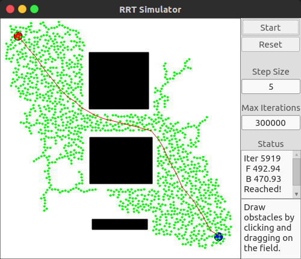

# RRT Simulator

## RRT-STAR algorithm added

## Dependencies
* Qt5
* Eigen

## Compiling
```bash

$ cd rrt-simulator/
$ mkdir build
$ cmake..
$ make -j

```
Run the exectuable as
```
$ ../bin/rrt-test
```
## Interface



*Note: Draw obstacles by clicking and dragging on the field.*
